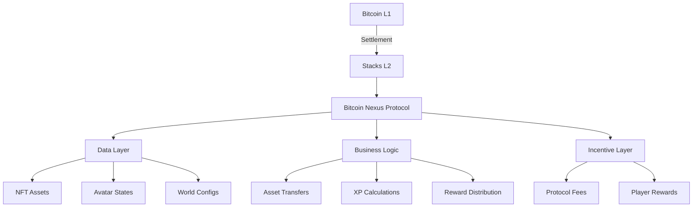

# Bitcoin Nexus Gaming Protocol

**A Layer 2 Gaming Ecosystem Powered by Bitcoin**

---

## Overview

Bitcoin Nexus is a decentralized gaming protocol built on Stacks (Bitcoin Layer 2) that integrates NFT-based assets, player progression systems, and Bitcoin-native rewards. Designed for both game developers and players, it enables:

- Secure ownership of NFT game assets with Bitcoin finality
- Cross-game avatar progression and achievement systems
- Configurable virtual worlds with competitive reward pools
- Transparent leaderboards with BTC-denominated prizes

---

## Core Features

### 🎮 NFT-Based Game Assets
- **Mintable Items**: Create in-game NFTs with rarity tiers (Common to Legendary), power levels, and custom attributes
- **Cross-World Compatibility**: Use assets across multiple game worlds while maintaining progression
- **Dynamic Metadata**: Track experience gains and evolution through on-chain state changes

### 👤 Player Identity System
- **Persistent Avatars**: Customizable characters with XP/level progression
- **Achievement Tracking**: Permanent record of in-game accomplishments
- **Equipment Management**: NFT-based inventory system with 5 equipment slots

### 🌍 Virtual Worlds
- **Configurable Environments**: Create worlds with entry requirements (e.g., minimum level, specific assets)
- **Active Player Tracking**: Real-time participant monitoring per world
- **Reward Pool System**: BTC-denominated prize pools that grow with protocol fees

### 🏆 Competitive Play
- **Global Leaderboards**: Transparent ranking system tracking scores, games played, and achievements
- **Automated BTC Distribution**: Weekly rewards to top performers via smart contracts
- **Anti-Cheat Protection**: On-chain validation of score submissions

---

## System Architecture

### Protocol Layers


### Key Integration Points
1. **Stacks Blockchain**: Handles NFT minting, asset transfers, and smart contract execution
2. **Bitcoin Network**: Processes final settlement of BTC rewards
3. **Game Engines**: Unity/Unreal integration through Web3 libraries
4. **Indexing Service**: The Graph-based subgraph for querying leaderboards and assets

---

## Smart Contract Specifications

### Core Data Structures
```clarity
;; NFT Asset Metadata
{
  name: (string-utf8 64),
  description: (string-utf8 256),
  rarity: {common; uncommon; rare; epic; legendary},
  power-level: uint,
  attributes: (list 10 (string-utf8 32)),
  experience: uint,
  level: uint
}

;; Avatar State
{
  player: principal,
  level: uint,
  equipped-items: (list 5 uint),
  accessible-worlds: (list 10 uint),
  achievements: (list 20 (string-utf8 64))
}

;; Leaderboard Entry
{
  score: uint,
  games-played: uint,
  total-rewards: uint,
  current-rank: uint
}
```

### Critical Functions
| Category         | Function                      | Description                                  |
|------------------|-------------------------------|----------------------------------------------|
| Asset Management | `mint-nexus-asset`            | Create new game item NFT with metadata       |
| Player Systems   | `update-avatar-experience`    | Level up system with XP validation           |
| World Creation   | `create-game-world`           | Deploy new virtual environment               |
| Competition      | `finalize-game-results`       | Update leaderboard and trigger BTC payouts   |
| Administration   | `update-protocol-parameters`  | Adjust fees, caps, and reward distribution   |

---

## Getting Started

### Requirements
- Node.js v18+ & npm
- [Hiro Wallet](https://www.hiro.so/wallet) (Testnet configured)
- Clarinet SDK

### Example: Minting a Legendary Weapon
```clarity
(contract-call? .bitcoin-nexus mint-nexus-asset
  "Dragonfang Blade" 
  "Forged in ancient lava flows" 
  {rarity: legendary} 
  u999 
  ["piercing-75%", "fire-damage-150", "bleed-effect"]
  u0  ;; Initial experience
  u1  ;; Starting level
)
```

---

## Contribution Guidelines

1. **Fork** the repository
2. Create a feature branch (`git checkout -b feature/your-feature`)
3. Add **tests** for all new functionality
4. Follow Clarity security best practices:
   - Use `asserts!` for all preconditions
   - Avoid runtime type conversions
   - Validate all user inputs
5. Submit a **Pull Request** with detailed documentation

---

## License

[](https://docs.stacks.co/write-smart-contracts/clarity)
[](https://bitcoin.org)
